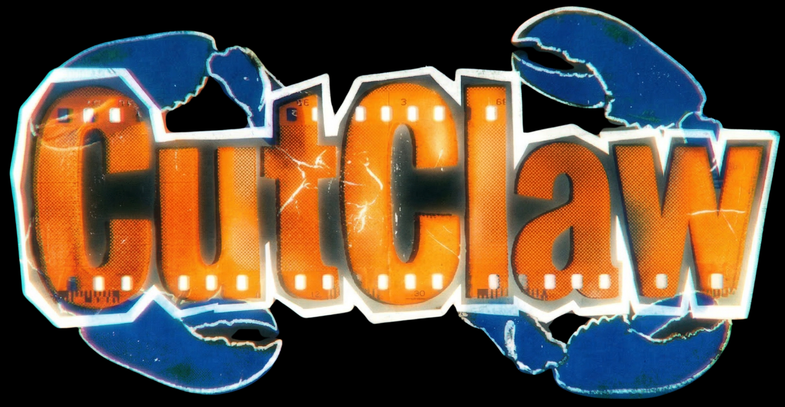

<div align="center">



# Agentic Hours-Long Video Editing via Music Synchronization

**AI multi-agent video editing for music-synchronized cinematic montages.**

[](https://www.python.org/downloads/)

<p align="center">
  
  
  
  
  
  
</p>

[Quick Start](#-quick-start) • [Output Paths](#-where-results-are-saved) • [Config](#️-config-srcconfigpy) • [Troubleshooting](#️-troubleshooting)

</div>

---

## 💡 Overview

CutClaw is an end-to-end editing system for long-form footage + music.

It first deconstructs raw video/audio into structured signals, then uses a multi-agent pipeline to plan shots (`shot_plan`), select clip timestamps (`shot_point`), and validate final quality before rendering.


---

## ✨ Key Features

<table align="center" width="100%" style="border: none; table-layout: fixed;">
<tr>
<td width="25%" align="center" style="vertical-align: top; padding: 16px;">

### 🎬 **One-Click Deconstruction**


Effortlessly transforms hours-long raw video and audio into structured, searchable assets with a single click.

</td>
<td width="25%" align="center" style="vertical-align: top; padding: 16px;">

### 🎯 **Instruction Control**


Requires only one text instruction to steer the editing style—easily generating fast-paced character montages or slow-paced emotional narratives.

</td>
<td width="25%" align="center" style="vertical-align: top; padding: 16px;">

### 📱 **Smart Auto-Cropping**


Content-aware cropping automatically identifies core subjects and adjusts aspect ratios to fit various social platforms.

</td>
<td width="25%" align="center" style="vertical-align: top; padding: 16px;">

### 🎵 **Music-Aware Sync**


Extracts musical beats and energy signals to build rhythm-aware cuts that perfectly match the music's pacing.

</td>
</tr>
</table>

---

## 🚀 Quick Start

### 1. Install

```bash
git clone https://github.com/GVCLab/CutClaw.git
cd CutClaw
conda create -n CutClaw python=3.12
conda activate CutClaw
pip install -r requirements.txt
```

> We strongly recommend the GPU-accelerated Decord/NVDEC build for faster video decoding. Build from [source](https://github.com/dmlc/decord?tab=readme-ov-file#install-from-source).

### 2. Add your files

```
resource/
├── video/      ← put your .mp4 / .mkv here
├── audio/      ← put your .mp3 / .wav here
└── subtitle/   ← optional .srt (skips ASR, saves time)
```

### 3. Run

**UI (recommended)**

```bash
streamlit run app.py
```
Then open `http://localhost:8501` in your browser. (*If `http://localhost:8501` does not work well, try `http://127.0.0.1:8501`)


> Place your footage in the paths above, then you can directly select those files in the UI.

Model selection guidance:

- **Video model**
  - **Role**: shot/scene understanding and visual captioning.
  - **Recommended**: Gemini-3, Qwen3.5, GPT-5.3

- **Audio model**
  - **Role**: ASR plus music-structure parsing (beat/downbeat, pitch, energy) for music-aware segmentation.
  - **Recommended**: Gemini-3

- **Agent model**
  - **Role**: drives the Screenwriter + Editor + Reviewer loop to generate `shot_plan` and `shot_point`.
  - **Recommended**: MiniMax-2.7, Kimi-2.5, Claude-4.5

We leverage `LiteLLM` as the api manager gateway, the typical Model name is e.g. 'openai/MiniMax-2.7' which means using openai protocol to call the given model, more information see [LiteLLM documents](https://github.com/BerriAI/litellm).


<details>
<summary><strong>CLI (advanced)</strong></summary>

```bash
python local_run.py \
  --Video_Path "resource/video/xxxx.mp4" \
  --Audio_Path "resource/audio/xxxx.mp3" \
  --Instruction "xxxx"
```

<details>
<summary>Common config overrides</summary>

Any `src/config.py` parameter can be overridden with `--config.PARAM_NAME VALUE`.

| Parameter | Default | Effect |
|---|---|---|
| `VIDEO_PATH` | `"resource/video/The_Dark_Knight.mkv"` | Default input video path used by UI remembered inputs |
| `AUDIO_PATH` | `"resource/audio/Way_Down_We_Go.mp3"` | Default input audio path used by UI remembered inputs |
| `INSTRUCTION` | `"Joker's crazy that want to change the world."` | Default editing instruction prompt |
| `ASR_BACKEND` | `"litellm"` | ASR engine (`litellm` cloud or `whisper_cpp` local) |
| `VIDEO_FPS` | `2` | Sampling FPS for preprocessing |
| `MAIN_CHARACTER_NAME` | `"Joker"` | Protagonist name for character-focused edits |
| `AUDIO_MIN_SEGMENT_DURATION` | `3.0` | Minimum beat segment duration (seconds) |
| `AUDIO_MAX_SEGMENT_DURATION` | `5.0` | Maximum beat segment duration (seconds) |
| `AUDIO_DETECTION_METHODS` | `["downbeat", "pitch", "mel_energy"]` | Audio keypoint detection methods |
| `PARALLEL_SHOT_MAX_WORKERS` | `4` | Parallel shot selection workers |

Example:

```bash
python local_run.py \
  --Video_Path "resource/video/xxxx.mp4" \
  --Audio_Path "resource/audio/xxxx.mp3" \
  --Instruction "xxxx" \
  --config.MAIN_CHARACTER_NAME "Batman" \
  --config.VIDEO_FPS 2 \
  --config.AUDIO_TOTAL_SHOTS 50
```

</details>


Then render manually:

```bash
python render/render_video.py \
  --shot-plan  "Output/<video_audio>/shot_plan_*.json" \
  --shot-json  "Output/<video_audio>/shot_point_*.json" \
  --video  "resource/video/xxxx.mp4" \
  --audio  "resource/audio/xxxx.mp3" \
  --output "output/final.mp4" \
  --crop-ratio "9:16" \
  --no-labels --render-hook-dialogue
```

</details>

---


## 🛠️ Troubleshooting

**Very slow runtime**

1. **API latency** — the pipeline sends a large number of concurrent requests to vision/language APIs. Speed is heavily dependent on your API provider's response time and rate limits.
2. **First-run Footage Deconstruction** — the first time you process a video, shot detection, captioning, ASR, and scene analysis all run from scratch. This is a one-time cost per video; subsequent edits with the same footage reuse the cached results and are much faster.
3. **GPU acceleration** — a CUDA-capable GPU significantly speeds up video decoding and encoding. We recommend building Decord with NVDEC support (see Install section).


## 🖼️ Gallery

<table width="100%">
<tr>
<td align="center" width="33%">
  <video src="https://github.com/user-attachments/assets/0eac0a2c-05ec-4eb9-b540-2752e9c35289" controls width="100%"></video>
</td>
<td align="center" width="33%">
  <video src="https://github.com/user-attachments/assets/0e191afb-aea7-4fcf-98d2-7b4b545f1a89" controls width="100%"></video>
</td>
<td align="center" width="33%">
  <video src="https://github.com/user-attachments/assets/59ccdd42-b4c8-4031-aa2c-3d7523b19024" controls width="100%"></video>
</td>
</tr>
</table>

<table width="100%">
<tr>
<td align="center" width="33%">
  <video src="https://github.com/user-attachments/assets/e41da312-9c20-4796-a600-a9f4534a7cd8" controls width="100%"></video>
</td>
<td align="center" width="33%">
  <video src="https://github.com/user-attachments/assets/c2212275-2a5f-42f5-9841-34e2573c8835" controls width="100%"></video>
</td>
<td align="center" width="33%">
  <video src="https://github.com/user-attachments/assets/1eb71636-f6ee-4a35-9a18-4f3e3f8eb5e7" controls width="100%"></video>
</td>
</tr>
</table>

<table width="100%">
<tr>
<td align="center" width="20%">
  <video src="https://github.com/user-attachments/assets/ac86d0c9-b652-4ec0-8527-1ebb0f465e7f" controls width="100%"></video>
</td>
<td align="center" width="20%">
  <video src="https://github.com/user-attachments/assets/970fd0c4-38c6-4674-8e5b-acfe4acba6ac" controls width="100%"></video>
</td>
<td align="center" width="20%">
  <video src="https://github.com/user-attachments/assets/8b02d26f-9b15-4961-b17a-74f915329021" controls width="100%"></video>
</td>
<td width="40%"></td>
</tr>
</table>


## ⭐ Citation
If you find PersonaLive useful for your research, welcome to cite our work using the following BibTeX:
<!-- ```bibtex
@article{li2025personalive,
  title={PersonaLive! Expressive Portrait Image Animation for Live Streaming},
  author={Li, Zhiyuan and Pun, Chi-Man and Fang, Chen and Wang, Jue and Cun, Xiaodong},
  journal={arXiv preprint arXiv:2512.11253},
  year={2025}
}
``` -->

